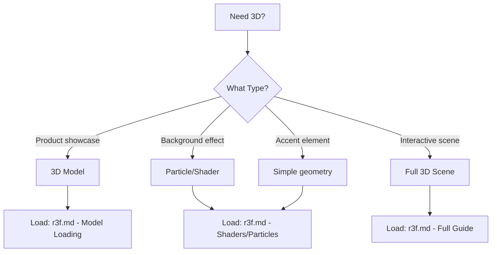

# 3D Graphics & WebGL

Tools for adding 3D elements and WebGL experiences to premium websites.

---

## 📚 Available Skills

| Skill | Use Case | Complexity | File |
|-------|----------|------------|------|
| **React Three Fiber (R3F)** | 3D scenes, models, shaders in React | Advanced | [r3f.md](./r3f.md) |

---

## 🎯 When to Use 3D



---

## 🚀 Common Use Cases

### Hero Background
**What:** Animated gradient mesh or particles  
**Performance:** Medium  
**Load:** `r3f.md` (Drei helpers section)

### Product Display
**What:** Rotating 3D model with controls  
**Performance:** Heavy  
**Load:** `r3f.md` (Model loading + Controls)

### Accent Elements
**What:** Floating spheres, geometric shapes  
**Performance:** Light  
**Load:** `r3f.md` (Basic geometries)

### Scroll-Linked 3D
**What:** 3D scene that responds to scroll  
**Performance:** Heavy  
**Load:** `r3f.md` + `../animation/gsap.md`

---

## ⚠️ Performance Considerations

### When to AVOID 3D
- ❌ Mobile-first sites (3D is heavy on mobile)
- ❌ Accessibility requirements (not screen-reader friendly)
- ❌ Sites with lots of images (GPU conflict)
- ❌ Client has low-end target audience

### When 3D ENHANCES
- ✅ Product portfolios (design, architecture)
- ✅ Hero sections with simple geometries
- ✅ Desktop-only experiences
- ✅ Creative agencies wanting "wow" factor

---

## 📦 Installation

```bash
# Core
npm install three @react-three/fiber

# Helpers (highly recommended)
npm install @react-three/drei

# Performance tools
npm install @react-three/postprocessing

# Load: r3f.md
```

---

## 🎨 Complexity Levels

### Level 1: Simple Shapes
- Floating spheres, cubes
- Basic materials
- **Effort:** 30 min  
- **Load Sections:** Basics, Geometries

### Level 2: Models + Animations
- GLTF model loading
- Auto-rotation, hover effects
- **Effort:** 2-3 hours  
- **Load Sections:** Models, Animations, Drei

### Level 3: Custom Shaders
- Fragment/vertex shaders
- Particle systems
- **Effort:** 4-8 hours  
- **Load Sections:** Shaders, Performance

### Level 4: Interactive Scenes
- Physics, raycasting
- Complex interactions
- **Effort:** 1-2 days  
- **Load Sections:** Full guide + docs

---

## 🏆 Awwwards Examples

| Effect | Complexity | Skills to Load |
|--------|------------|----------------|
| Gradient mesh hero | Medium | `r3f.md` (Shaders) |
| Rotating product | Easy | `r3f.md` (Models, Controls) |
| Particle background | Medium | `r3f.md` (Particles, Shaders) |
| 3D scroll story | Hard | `r3f.md` + `../animation/gsap.md` |

---

## 🎯 Integration with Other Skills

### With GSAP
**Use Case:** Scroll-controlled 3D camera  
**Load:** `r3f.md` + `../animation/gsap.md`

### With Aceternity/Magic UI
**Use Case:** 3D accent in hero section  
**Load:** `r3f.md` + `../ui-libraries/aceternity.md`

### With Lenis
**Use Case:** Smooth scroll with 3D parallax  
**Load:** `r3f.md` + `../animation/lenis.md`

---

## ⚡ Optimization Checklist

- [ ] Limit poly count (<100k triangles)
- [ ] Use texture compression
- [ ] Implement LOD (Level of Detail)
- [ ] Lazy load 3D scenes
- [ ] Disable on mobile or simplify heavily
- [ ] Use `@react-three/drei`'s performance helpers
- [ ] Monitor FPS (aim for 60fps)

---

## 📖 Quick Start

```typescript
// Basic setup
import { Canvas } from '@react-three/fiber'
import { OrbitControls } from '@react-three/drei'

function Scene() {
  return (
    <Canvas>
      <ambientLight intensity={0.5} />
      <OrbitControls />
      <mesh>
        <boxGeometry />
        <meshStandardMaterial color="hotpink" />
      </mesh>
    </Canvas>
  )
}
```

**For full implementation:** Load `r3f.md`

---

*3D should enhance, not hinder. Always provide 2D fallback.*
