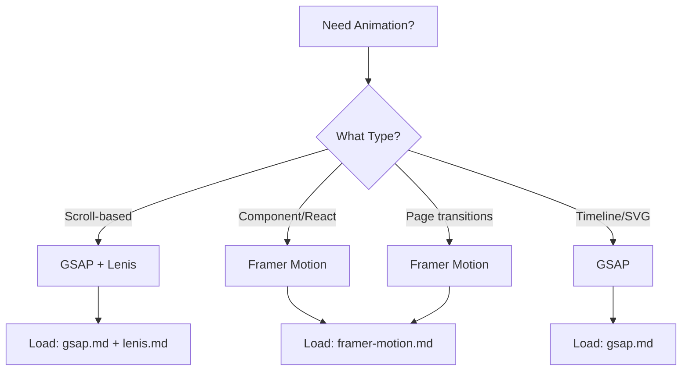

# Animation & Motion Skills

Premium animation tools for creating fluid, performant, wow-factor animations.

---

## 📚 Available Skills

| Skill | Best For | Complexity | File |
|-------|----------|------------|------|
| **GSAP** | Scroll animations, complex timelines, SVG morphing | Advanced | [gsap.md](./gsap.md) |
| **Framer Motion** | React component animations, page transitions | Medium | [framer-motion.md](./framer-motion.md) |
| **Lenis** | Buttery smooth scrolling foundation | Easy | [lenis.md](./lenis.md) |

---

## 🎯 Decision Tree



---

## 🚀 Quick Start Patterns

### Smooth Scroll Setup
```bash
# Load: lenis.md
npm install @studio-freight/lenis
```
Use for: Foundation for ALL premium sites

### Scroll-Triggered Animations
```bash
# Load: gsap.md + lenis.md
npm install gsap @studio-freight/lenis
```
Use for: Parallax, fade-ins, scroll reveals

### Page Transitions
```bash
# Load: framer-motion.md
npm install framer-motion
```
Use for: Route changes, modal entrances

### Complex Timelines
```bash
# Load: gsap.md
npm install gsap
```
Use for: Hero sequences, SVG animations, character movement

---

## ⚡ Performance Best Practices

- **Always use** `will-change` sparingly
- **Prefer** `transform` and `opacity` for animations
- **Use** GSAP for scroll-heavy sites (better performance than Framer)
- **Use** Framer Motion for React-heavy component animations
- **Combine** Lenis + GSAP ScrollTrigger for ultimate smoothness

---

## 🏆 Awwwards Examples

| Site Feature | Stack | Skills to Load |
|--------------|-------|----------------|
| Smooth parallax hero | GSAP + Lenis | `gsap.md`, `lenis.md` |
| Animated card grid | Framer Motion | `framer-motion.md` |
| Text reveal on scroll | GSAP | `gsap.md` |
| Modal with spring physics | Framer Motion | `framer-motion.md` |

---

## 📖 Loading Instructions

1. **Start with Lenis** if site has scroll
2. **Add GSAP** for scroll-triggered animations
3. **Add Framer Motion** for component-level animations
4. **Avoid mixing** GSAP and Framer Motion on same element

---

*Always prioritize 60fps performance. Test on mobile devices.*
