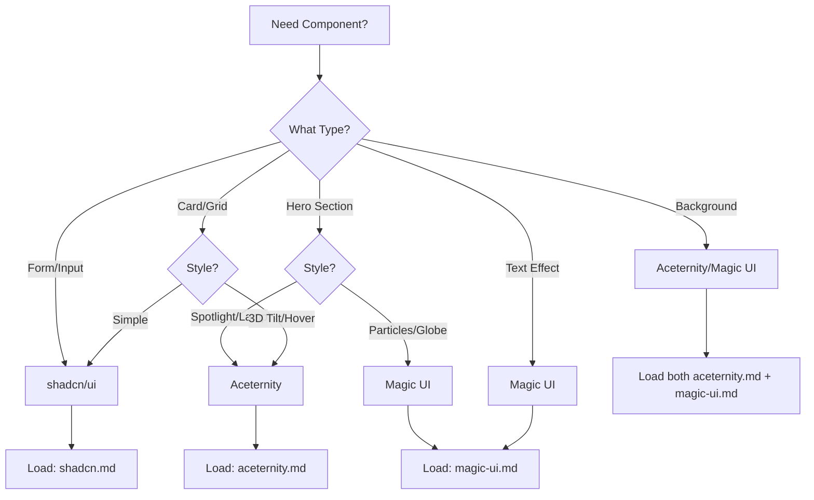

# UI Component Libraries

Curated selection of premium and base UI libraries for modern web experiences.

---

## 📚 Available Skills

| Library | Type | Use Case | File |
|---------|------|----------|------|
| **shadcn/ui** | Base Components | Forms, layouts, accessible foundations | [shadcn.md](./shadcn.md) |
| **Aceternity UI** | Premium Animated | Hero sections, cards, wow effects | [aceternity.md](./aceternity.md) |
| **Magic UI** | Premium Effects | Text animations, particles, backgrounds | [magic-ui.md](./magic-ui.md) |

---

## 🎯 Component Selection Guide



---

## 🎨 Component Categories

### Base & Accessible (shadcn/ui)
- ✅ Forms (Input, Select, Checkbox)
- ✅ Layout (Card, Separator, Tabs)
- ✅ Overlays (Dialog, Sheet, Popover)
- ✅ Navigation (Menu, Command)

**Load:** `shadcn.md`

### Hero & Spotlight (Aceternity UI)
- 🌟 Spotlight Card
- 🌟 Lamp Effect
- 🌟 Aurora Background
- 🌟 Vortex
- 🌟 3D Card Effect

**Load:** `aceternity.md`

### Text & Effects (Magic UI)
- ✨ Word Pull Up
- ✨ Blur In
- ✨ Gradual Spacing
- ✨ Flip Text
- ✨ Typing Animation

**Load:** `magic-ui.md`

### Backgrounds & Patterns
- Aceternity: Grid, Starfield, Vortex
- Magic UI: Dot Pattern, Ripple, Animated Gradient

**Load:** Both

---

## 📦 Installation Priority

### Phase 1: Foundation
```bash
npx shadcn@latest init
# Load: shadcn.md
```

### Phase 2: Premium (Hero)
```bash
# Copy from ui.aceternity.com or magicui.design
# Load: aceternity.md OR magic-ui.md
```

### Phase 3: Effects
```bash
# Copy additional components as needed
# Load relevant skill files
```

---

## 🏆 Awwwards Recipes

### Landing Page Hero
**Components:** Aceternity Spotlight + Magic UI Text Effect  
**Load:** `aceternity.md`, `magic-ui.md`

### Feature Section
**Components:** Aceternity Bento Grid + shadcn Card  
**Load:** `aceternity.md`, `shadcn.md`

### Form Section
**Components:** shadcn Form + Magic UI Blur In  
**Load:** `shadcn.md`, `magic-ui.md`

---

## ⚡ Best Practices

1. **Start with shadcn** for structure and accessibility
2. **Layer Aceternity/Magic** for premium sections only
3. **Don't overuse** premium effects (hero, CTA, 1-2 features max)
4. **Customize** - don't use components as-is, blend styles
5. **Test performance** - premium components are heavier

---

## 🎯 Dynamic Loading Strategy

| Building Section | Load Order |
|------------------|------------|
| Contact form | `shadcn.md` only |
| Hero section | `aceternity.md` → customize with `magic-ui.md` text |
| Card grid | `shadcn.md` (base) → `aceternity.md` (hover effects) |
| Background | `aceternity.md` OR `magic-ui.md` |

---

*Premium doesn't mean cluttered. Use focal points strategically.*
